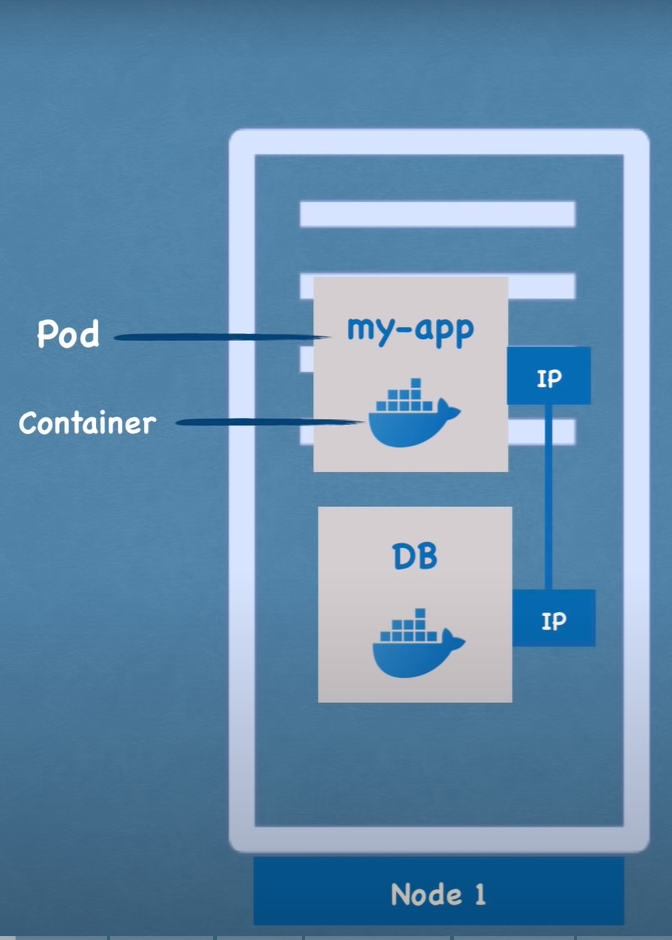
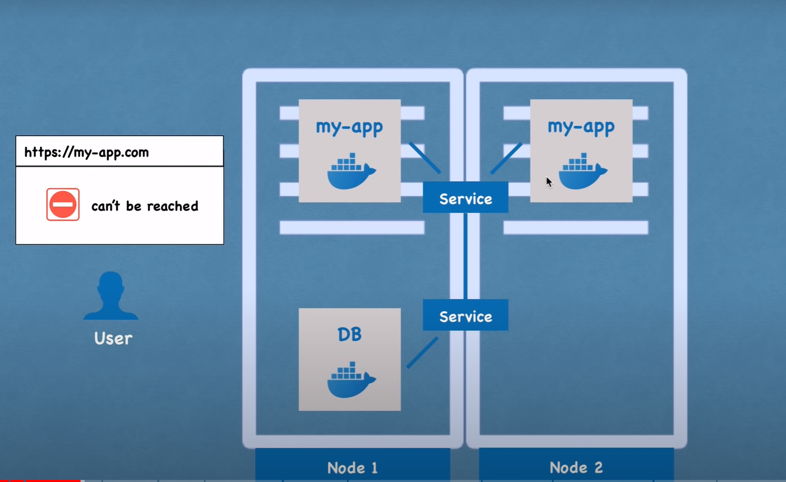
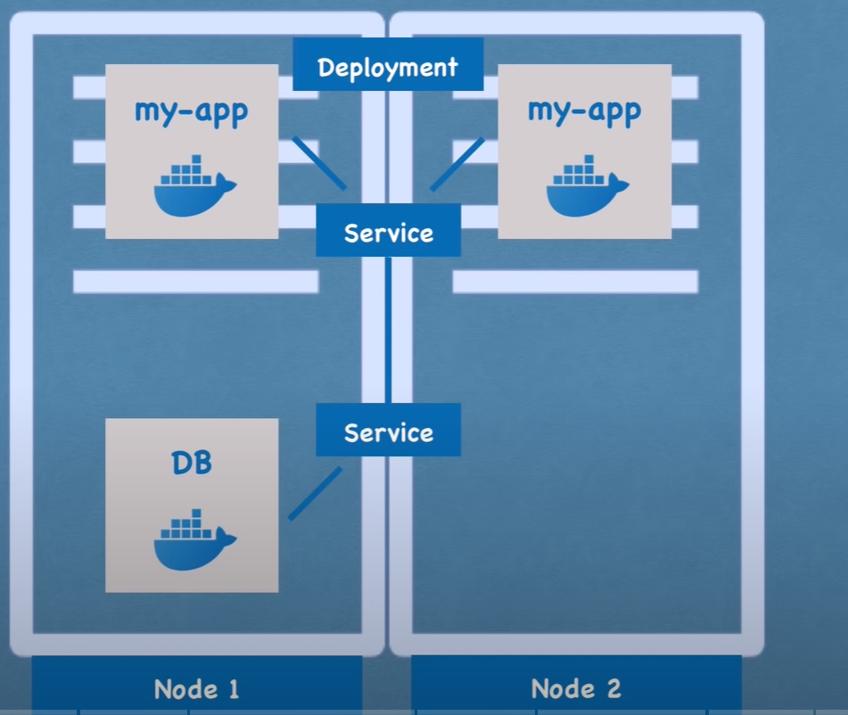
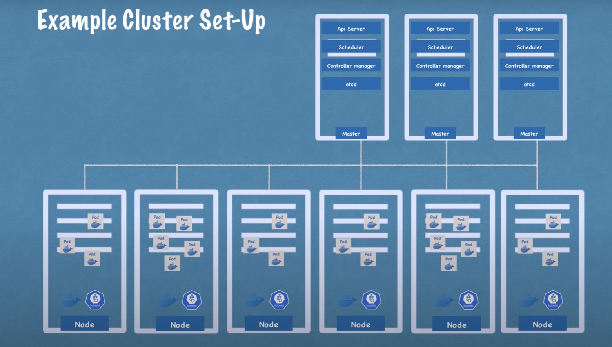

# KUBERNETES 101

---

## Kubernetes Components

---

    <b>POD<b> 
     
    
     - smallest unit of K8S 
     - abstraction over container
     - usually 1 application per Pod
     - each pod has its own IP address (internal)       
     - auto re-creation on crash

    <b>SERVICE<b> 
     
    
     - permanent IP address
     - load balancer

    <b>DEPLOYMENT<b> 
     
    
     - abstraction over pods
     - blueprint for app pods

## Kubernetes Architecture

Master nodes  
Worker nodes  

***
## Minikube 101

Start minikube with 4 CPUS, 4GB RAM, and enable autoscaler:
<code>
minikube start --cpus 4 --memory 4000 --driver=docker --extra-config=controller-manager.horizontal-pod-autoscaler-downscale-delay=1m
</code>

 
Basic cmds:
  <code>kubectl get nodes</code>
  <code>kubectl get pod</code>
  <code>kubectl get services</code>
  <code>kubectl get deployment</code>

 Create deployment with docker image:
<code>kubectl create deployment $NAME --image=image</code>
<code>kubectl get replicaset</code>

Logs:
<code>kubectl logs $REPLICASET_NAME</code>

Terminal in pod:
<code>kubectl exec -it $POD_NAME -- /bin/bash</code>

Delete deployment:
<code>kubectl delete deployment $DEPLOYMENT_NAME</code>

Create deployment from file:
<code>kubectl apply -f config-file.yaml</code>

---

### Docker images for services

#### Step 1: add pom dependency

<pre>
    <code>
        <build>
                <plugins>
                    <plugin>
                        <groupId>org.springframework.boot</groupId>
                        <artifactId>spring-boot-maven-plugin</artifactId>
                        <configuration>
                            <image>
                                <name>
                                    vital7b/name-service:V1</name>
                            </image>
                            <pullPolicy>
                                IF_NOT_PRESENT
                            </pullPolicy>
                        </configuration>
                    </plugin>
                </plugins>
            </build>
    </code>
</pre>

#### Step 2: make the image

<code>mvn spring-boot:build-image</code>

#### Step 3: push the image to docker.io

<code>
docker login
</code>
<code>
docker push vital7b/name-service:V1
</code>

#### Step 4: start docker container

<code>
docker run -p port:port --network host vital7b/name-service:V1
</code>

---

### Deploy service in k8s using a configuration file

#### Step 1: Create the deployment config file

<pre>
<code>
apiVersion: apps/v1
kind: Deployment
metadata:
  name: domain-depl
  labels:
    app: domain
spec:
  replicas: 2
  selector:
    matchLabels:
      app: domain
  strategy:
    rollingUpdate:
      maxSurge: 25%
      maxUnavailable: 25%
    type: RollingUpdate
  template:
    metadata:
      labels:
        app: domain
    spec:
      containers:
        - image: vital7b/domain-service:V1
          ports:
            - containerPort: 5000
          imagePullPolicy: IfNotPresent
          name: frontend-demo
          resources:
            requests:
              cpu: 250m
              memory: 128Mi
      dnsPolicy: ClusterFirst
      restartPolicy: Always
      schedulerName: default-scheduler
      terminationGracePeriodSeconds: 30

---
apiVersion: v1
kind: Service
metadata:
  name: domain-service
spec:
  selector:
    app: domain
  ports:
    - protocol: TCP
      port: 5000
      targetPort: 5000
  type: LoadBalancer

</code>
</pre>

#### Step 2: Create a service for local PostgreSQL db

<code>
$ minikube tunnel
</code>

<pre>
<code>
apiVersion: v1
kind: Service
metadata:
  name: postgres
spec:
  type: ClusterIP
  ports:
  - port: 5432
    targetPort: 5432
---
apiVersion: v1
kind: Endpoints
metadata:
  name: postgres
subsets:
  - addresses:
      - ip: 10.96.0.0
    ports:
      - port: 5432
</code>
</pre>

<code>
kubectl apply -f postgres-service.yaml
</code>
